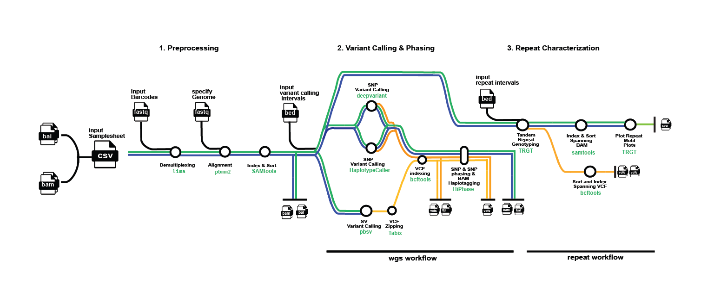

<h1>
  <picture>
    <source media="(prefers-color-scheme: dark)" srcset="docs/images/nf-core-pacvar_logo_dark.png">
    
  </picture>
</h1>

[](https://github.com/nf-core/pacvar/actions/workflows/ci.yml)
[](https://github.com/nf-core/pacvar/actions/workflows/linting.yml)[](https://nf-co.re/pacvar/results)[](https://doi.org/10.5281/zenodo.14813048)
[](https://www.nf-test.com)

[](https://www.nextflow.io/)
[](https://docs.conda.io/en/latest/)
[](https://www.docker.com/)
[](https://sylabs.io/docs/)
[](https://cloud.seqera.io/launch?pipeline=https://github.com/nf-core/pacvar)

[](https://nfcore.slack.com/channels/pacvar)[](https://twitter.com/nf_core)[](https://mstdn.science/@nf_core)[](https://www.youtube.com/c/nf-core)

## Introduction

nf-core/pacvar is a bioinformatics pipeline that processes long-read PacBio data. Specifically, the pipeline provides two workflows: one for processing whole-genome sequencing data, and another for processing reads from the PureTarget expansion panel offered by PacBio. This second workflow characterizes tandem repeats. Because the pipeline is designed for PacBio reads, it uses PacBio’s officially released tools.



Workflow Overview

1. Demultiplex reads ([`lima`](https://lima.how))
2. Align reads ([`pbmm2`](https://github.com/PacificBiosciences/pbmm2))
3. Sort and index alignments ([`SAMtools`](https://sourceforge.net/projects/samtools/files/samtools/))

WGS Workflow Overview

1. Choice of SNP calling routes:
   a. ([`deepvariant`](https://github.com/google/deepvariant))
   b. ([`HaplotypeCaller`](https://gatk.broadinstitute.org/hc/en-us/articles/360037225632-HaplotypeCaller))
2. Call SVs ([`pbsv`](https://github.com/PacificBiosciences/pbsv))
3. Index VCF files ([`bcftools`](https://samtools.github.io/bcftools/bcftools.html))
4. Phase SNPs, SVs and BAM files ([`hiphase`](https://github.com/PacificBiosciences/HiPhase))

Tandem Repeat Workflow Overview

1. Genotype tandem repeats - produce spanning bams and vcf ([`TRGT`](https://github.com/PacificBiosciences/trgt))
2. Index and Sort tandem tepeat spanning bam ([`SAMtools`](https://sourceforge.net/projects/samtools/files/samtools/))
3. Plot repeat motif plots ([`TRGT`](https://github.com/PacificBiosciences/trgt))
4. Sort spanning VCF ([`bcftools`](https://samtools.github.io/bcftools/bcftools.html))

## Usage

> [!NOTE]
> If you are new to Nextflow and nf-core, please refer to [this page](https://nf-co.re/docs/usage/installation) on how to set-up Nextflow. Make sure to [test your setup](https://nf-co.re/docs/usage/introduction#how-to-run-a-pipeline) with `-profile test` before running the workflow on actual data.

First, prepare a samplesheet with your input data that looks as follows:

`samplesheet.csv`:

```csv
sample,bam,pbi
CONTROL,AEG588A1_S1_L002_R1_001.bam,AEG588A1_S1_L002_R1_001.pbi
```

Note that the `.pbi` file is not required. If you choose not to include it, your input file might look like this:

```csv
sample,bam,pbi
CONTROL,AEG588A1_S1_L002_R1_001.bam
```

Each row represents an unaligned bam file and their associated index (optional).

Now, you can run the pipeline. Below is an example

```bash
nextflow run nf-core/pacvar \
   -profile <docker/singularity/.../institute> \
   --input samplesheet.csv \
   --workflow <wgs/repeat> \
   --barcodes barcodes.bed \
   --intervals intervals.bed \
   --genome <GENOME NAME (e.g. GATK.GRCh38)> \
   --outdir <OUTDIR>
```

optional paramaters include: `--skip_demultiplexing`, `--skip_snp`, `--skip_sv`, `--skip_phase`.

> [!WARNING]
> Please provide pipeline parameters via the CLI or Nextflow `-params-file` option. Custom config files including those provided by the `-c` Nextflow option can be used to provide any configuration _**except for parameters**_; see [docs](https://nf-co.re/docs/usage/getting_started/configuration#custom-configuration-files).
> Please provide pipeline parameters via the CLI or Nextflow `-params-file` option. Custom config files including those provided by the `-c` Nextflow option can be used to provide any configuration _**except for parameters**_; see [docs](https://nf-co.re/docs/usage/getting_started/configuration#custom-configuration-files).

For more details and further functionality, please refer to the [usage documentation](https://nf-co.re/pacvar/usage) and the [parameter documentation](https://nf-co.re/pacvar/parameters).

## Pipeline output

To see the results of an example test run with a full size dataset refer to the [results](https://nf-co.re/pacvar/results) tab on the nf-core website pipeline page.
For more details about the output files and reports, please refer to the
[output documentation](https://nf-co.re/pacvar/output).

## Credits

nf-core/pacvar was originally written by Tanya Sarkin Jain.

We thank the following people for their extensive assistance in the development of this pipeline:

## Contributions and Support

If you would like to contribute to this pipeline, please see the [contributing guidelines](.github/CONTRIBUTING.md).

For further information or help, don't hesitate to get in touch on the [Slack `#pacvar` channel](https://nfcore.slack.com/channels/pacvar) (you can join with [this invite](https://nf-co.re/join/slack)).

## Citations

If you use nf-core/pacvar for your analysis, please cite it using the following doi: [10.5281/zenodo.14813048](https://doi.org/10.5281/zenodo.14813048)

An extensive list of references for the tools used by the pipeline can be found in the [`CITATIONS.md`](CITATIONS.md) file.

You can cite the `nf-core` publication as follows:

> **The nf-core framework for community-curated bioinformatics pipelines.**
>
> Philip Ewels, Alexander Peltzer, Sven Fillinger, Harshil Patel, Johannes Alneberg, Andreas Wilm, Maxime Ulysse Garcia, Paolo Di Tommaso & Sven Nahnsen.
>
> _Nat Biotechnol._ 2020 Feb 13. doi: [10.1038/s41587-020-0439-x](https://dx.doi.org/10.1038/s41587-020-0439-x).
